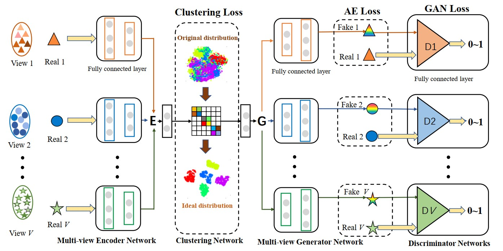
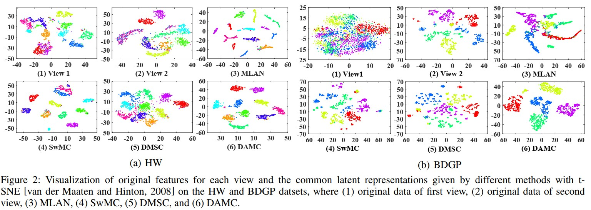

#DAMC: Deep Adversarial Multi-view Clustering Network#

###This repo contains the source code and dataset for our IJCAI 2019 paper:###

###Zhaoyang Li, Qianqian Wang, Zhiqiang Tao, Quanxue Gao, and Zhaohua Yang. Deep Adversarial Multi-view Clustering Network, IJCAI, 2019:2952-2958.###

[Paper Link](https://www.researchgate.net/profile/Qianqian-Wang-28/publication/334844473_Deep_Adversarial_Multi-view_Clustering_Network/links/5ea5cfada6fdccd7945727e2/Deep-Adversarial-Multi-view-Clustering-Network.pdf)

Bibtex

@inproceedings{li2019deep,  
  title={Deep adversarial multi-view clustering network},  
  author={Li, Zhaoyang and Wang, Qianqian and Tao, Zhiqiang and Gao, Quanxue and Yang, Zhaohua},  
  booktitle={Proceedings of the 28th International Joint Conference on Artificial Intelligence},  
  pages={2952--2958},  
  year={2019},  
}  
 

**DAMC Model:**

<div style="text-align: center; width: 900px; border: green solid 1px;">

<br></br>
<center>Figure 1: Network Model</center>
</div>

**Introduction**

Multi-view clustering has attracted increasing attention in recent years by exploiting common clustering structure across multiple views. Most existing multi-view clustering algorithms use shallow and linear embedding functions to learn the common structure of multi-view data. However, these methods cannot fully utilize the non-linear property of multi-view data that is important to reveal complex cluster structure. In this paper, we propose a novel multi-view clustering method, named Deep Adversarial Multi-view Clustering (DAMC) network, to learn the intrinsic structure embedded in multi-view data. Specifically, our model adopts deep auto-encoders to learn latent representations shared by multiple views, and meanwhile leverages adversarial training to further capture the data distribution and disentangle the latent space. Experimental results on several real-world datasets demonstrate the proposed method outperforms the state-of art methods.

<div style="text-align: center; width: 900px; border: green solid 1px;">

<br></br>
<center></center>
</div>

**Datasets**

To demonstrate the performance of the proposed framework, we evaluate DAMC on four multi-view datasets. A brief introduction is given as follows.  
 (1) Image dataset: Handwritten numerals (HW) dataset is composed of 2,000 data points from 0 to 9 ten digit classes and each class has 200 data points. In the experiment, we adopt 76 Fourier coefficients of the character shapes and 216 profile correlations as two different views.  
 (2) Image and text dataset: BDGP is a two-view dataset including two different modalities, i.e., visual and textual data. It contains 2,500 images about drosophila embryos belonging to 5 categories. Each image is represented by a 1,750-D visual vector and a 79-D textual feature vector. In our experiment, we use the entire BDGP dataset and evaluate the performance on both visual and textual feature.  
 (3) Video dataset: The Columbia Consumer Video (CCV) dataset contains 9,317 YouTube videos with 20 diverse semantic categories. In our experiment, we use the subset (6773 videos) of CCV, along with three hand-crafted features: STIP features with 5,000 dimensional Bag-of-Words (BoWs) representation, SIFT features extracted every two seconds with 5,000 dimensional BoWs representation, and MFCC features with 4,000 dimensional BoWs representation.  
 (4) Large-scale dataset: MNIST is a widely-used benchmark dataset consisting of handwritten digit images with 28 \times 28 pixels. In our experiment, we employ its two-view version (70,000 samples) provided by~\cite{VIGAN}, where the first view is the original gray images and the other is given by images only highlighting the digit edge.  


**Requirements**

Python: Python 3.6.2：  
Pytorch: 0.1.12  
Numpy: 1.13.1  
TorchVision: 0.1.8  
Cuda: 11.2  


**Train the model**  

```
python train.py
```

**Acknowledgments**

Code is inspired by VIGAN(https://github.com/chaoshangcs/VIGAN) CycleGAN(https://github.com/chaoshangcs/pytorch-CycleGAN-and-pix2pix).


